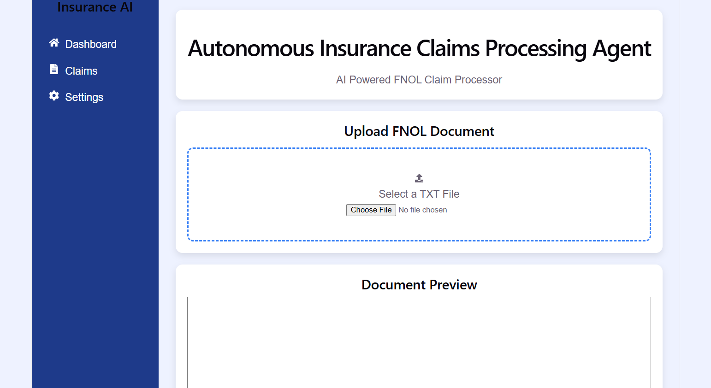
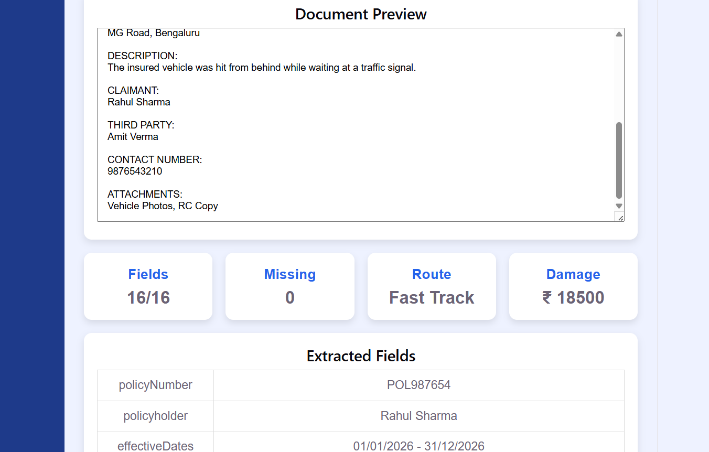
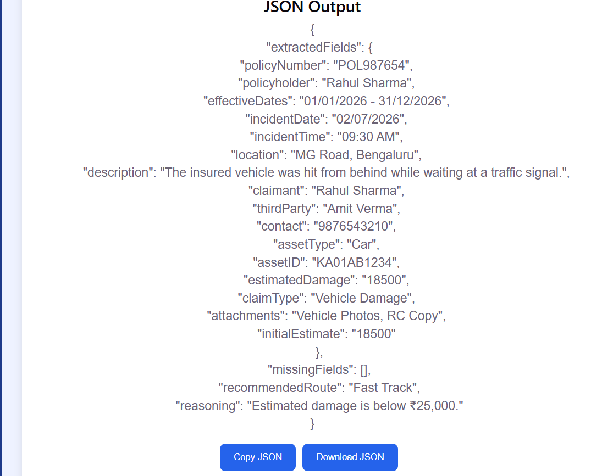

# 🛡 Autonomous Insurance Claims Processing Agent

A lightweight AI-inspired web application built with **React.js** that automates the initial processing of **First Notice of Loss (FNOL)** insurance claims.

The application extracts important claim information from uploaded **TXT** and **PDF** documents, validates mandatory fields, classifies the claim, recommends the correct processing workflow, and generates the required JSON output.

---

# 📌 Problem Statement

Insurance companies receive thousands of FNOL (First Notice of Loss) documents every day. Manually reviewing each document is time-consuming and error-prone.

This application automates the initial processing by:

- Extracting important claim information
- Identifying missing mandatory fields
- Detecting suspicious claim descriptions
- Routing claims to the appropriate workflow
- Generating structured JSON output

---

# 🚀 Features

### 📂 Document Upload
- Upload TXT documents
- Upload PDF documents
- Document preview

### 📄 Automatic Field Extraction

Extracts:

- Policy Number
- Policyholder Name
- Effective Dates
- Incident Date
- Incident Time
- Location
- Description
- Claimant
- Third Party
- Contact Number
- Asset Type
- Asset ID
- Estimated Damage
- Claim Type
- Attachments
- Initial Estimate

---

### ✅ Validation

Checks for:

- Missing mandatory fields
- Empty values
- Basic inconsistencies

---

### 🚦 Claim Routing

The application automatically routes claims using predefined business rules.

| Condition | Route |
|-----------|-------|
| Estimated Damage < ₹25,000 | ⚡ Fast Track |
| Missing Mandatory Fields | 📝 Manual Review |
| Description contains "fraud", "staged", "inconsistent" | 🚨 Investigation Flag |
| Claim Type = Injury | 🏥 Specialist Queue |
| Otherwise | 📂 Standard Processing |

---

### 📦 JSON Output

Produces the required output format:

```json
{
  "extractedFields": {},
  "missingFields": [],
  "recommendedRoute": "",
  "reasoning": ""
}
```

---

# 🛠 Tech Stack

### Frontend

- React.js
- JavaScript (ES6)
- HTML5
- CSS3

### Libraries

- pdfjs-dist
- React Hooks (useState)

### Tools

- VS Code
- Git
- GitHub

---

# 📁 Folder Structure

```
insurance-claims-agent

src
│
├── components
│   ├── Header.jsx
│   ├── Upload.jsx
│   ├── Sidebar.jsx
│   ├── DashboardCards.jsx
│   ├── DocumentPreview.jsx
│   ├── ExtractedFields.jsx
│   ├── ValidationPanel.jsx
│   ├── RoutePanel.jsx
│   ├── JsonOutput.jsx
│   └── Footer.jsx
│
├── utils
│   ├── parser.js
│   ├── validator.js
│   ├── router.js
│   └── pdfReader.js
│
├── App.jsx
├── App.css
└── main.jsx

public
└── sample-docs
```

---

# ⚙ Installation

Clone the repository

```bash
git clone https://github.com/vaish-05-oppo/insurance-claims-agent.git
```

Move into the project

```bash
cd insurance-claims-agent
```

Install dependencies

```bash
npm install
```

Run the application

```bash
npm run dev
```

Open

```
http://localhost:5173
```

---
# ⚙️ Installation & Steps to Run

## Prerequisites

Make sure the following are installed on your system:

- Node.js (v18 or above)
- npm (comes with Node.js)
- Git (optional, for cloning the repository)

---

## 1. Clone the Repository

```bash
git clone https://github.com/vaish-05-oppo/insurance-claims-agent.git
```

---

## 2. Navigate to the Project Folder

```bash
cd insurance-claims-agent
```

---

## 3. Install Dependencies

```bash
npm install
```

---

## 4. Start the Development Server

```bash
npm run dev
```

---

## 5. Open the Application

Open your browser and navigate to:

```
http://localhost:5173
```

---

## 6. Test the Application

1. Upload a sample **TXT** or **PDF** FNOL document.
2. The application extracts the claim details automatically.
3. Missing mandatory fields are validated.
4. The appropriate claim route is recommended.
5. The generated JSON output is displayed.
6. Use **Copy JSON** or **Download JSON** if required.

# 🧪 Sample Test Documents

The repository includes sample FNOL documents.

- claim1.txt (Fast Track)
- claim2.txt (Manual Review)
- claim3.txt (Investigation Flag)
- claim4.txt (Specialist Queue)
- claim5.txt (Standard Processing)

These documents can be found in:

```
public/sample-docs/
```

---

# 🖥 Application Workflow

1. Upload a TXT or PDF FNOL document.
2. Preview the uploaded document.
3. Automatically extract claim information.
4. Validate mandatory fields.
5. Detect inconsistencies and fraud-related keywords.
6. Recommend the appropriate routing decision.
7. Display structured JSON output.
8. Copy or download the generated JSON.

---

# 📸 Screenshots

## Home Dashboard



---

## Upload & Field Extraction



---

## Generated JSON Output



---

# 🔮 Future Enhancements

- OCR support for scanned documents
- AI-powered NLP extraction
- Database integration
- Email notifications
- Authentication and user roles
- Claim history dashboard
- Cloud deployment

---

# 👩‍💻 Developed By

**Vaishnavi M**

BE – Artificial Intelligence & Machine Learning

Brindavan College of Engineering

GitHub: https://github.com/vaish-05-oppo

---

# 📄 License

This project was developed as part of a technical assessment for educational and evaluation purposes.